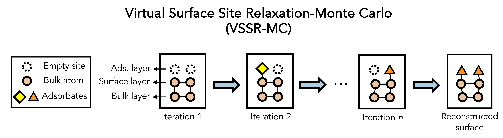

# Virtual Surface Site Relaxation-Monte Carlo (VSSR-MC)
<!-- TBD update with my own icons -->
<!-- Taken from CHGNet -->
<!-- [](https://github.com/CederGroupHub/chgnet/actions/workflows/test.yml)
[](https://app.codacy.com/gh/CederGroupHub/chgnet/dashboard?utm_source=gh&utm_medium=referral&utm_content=&utm_campaign=Badge_coverage)
 -->
[](https://arxiv.org/abs/2305.07251)
[](https://zenodo.org/doi/10.5281/zenodo.7758174)

## Contents
- [Overview](#overview)
- [System requirements](#system-requirements)
- [Setup](#setup)
- [Demo](#demo)
- [Scripts](#scripts)
- [Citation](#citation)
- [Development & Bugs](#development--bugs)


# Overview
This is the VSSR-MC algorithm for sampling surface reconstructions. VSSR-MC samples across both compositional and configurational spaces. It can interface with both a neural network potential (through [ASE](https://wiki.fysik.dtu.dk/ase/)) or a classical potential (through ASE or [LAMMPS](https://www.lammps.org/)). It is a key component of the Automatic Surface Reconstruction (AutoSurfRecon) pipeline described in the following work: [Machine-learning-accelerated simulations to enable automatic surface reconstruction](https://doi.org/10.1038/s43588-023-00571-7).



# System requirements
We recommend a computer with the following specs:

- RAM: 16+ GB
- CPU: 4+ cores, 3 GHz/core

To run with a neural network force field, a GPU is recommended. We ran on a single NVIDIA GeForce RTX 2080 Ti 11 GB GPU. The code has been tested on *Linux* Ubuntu 20.04.6 LTS and macOS Sonoma 14.5 but we expect it to be system agnostic.

# Setup
To start, run `git clone git@github.com:learningmatter-mit/surface-sampling.git` to your local directory or a workstation.

## Conda environment
We recommend creating a new [Conda](https://docs.conda.io/projects/conda/en/latest/user-guide/install/linux.html) environment. Following that, the Python dependencies for the code can be installed. In the `surface-sampling` directory, run the following commands:
```bash
conda create -n vssr-mc python=3.11
conda activate vssr-mc
conda install -c conda-forge kimpy lammps openkim-models
pip install -e .
```

To run with LAMMPS, add the following to `~/.bashrc` or equivalent with appropriate paths and then `source ~/.bashrc`. `pip` would have installed LAMMPS as a dependency.
```bash
export LAMMPS_COMMAND="/path/to/lammps/src/lmp"
export LAMMPS_POTENTIALS="/path/to/lammps/potentials/"
export ASE_LAMMPSRUN_COMMAND="$LAMMPS_COMMAND"
```
The `LAMMPS_COMMAND` should point to the LAMMPS executable and might be found here `/path/to/env/bin/lmp`
The `LAMMPS_POTENTIALS` directory should contain the LAMMPS potential files and might be found here `/path/to/env/lib/python3.11/site-packages/lammps/share/lammps/potentials/`.
The `ASE_LAMMPSRUN_COMMAND` should point to the LAMMPS executable. More information can be found here: [ASE LAMMPS](https://wiki.fysik.dtu.dk/ase/ase/calculators/lammpsrun.html).
If the `pip` installed LAMMPS does not work, you might have to install LAMMPS from source. More information can be found here: [LAMMPS](https://lammps.sandia.gov/doc/Build.html).

You might have to re-open/re-login to your terminal shell for the new settings to take effect.

# Demo
A toy demo and other examples can be found in the `tutorials/` folder.
```
tutorials/
├── example.ipynb
└── GaN_0001.ipynb
└── Si_111_5x5.ipynb
└── SrTiO3_001.ipynb
└── latent_space_clustering.ipynb
```
 More data/examples can be found in our [Zenodo dataset](https://doi.org/10.5281/zenodo.7758174).

## Toy example of Cu(100)
A toy example to illustrate the use of VSSR-MC. It should only take about a few seconds to run. Refer to `tutorials/example.ipynb`.

## GaN(0001) surface sampling with Tersoff potential
This example could take a few minutes to run. Refer to `tutorials/GaN_0001.ipynb`.

## Si(111) 5x5 surface sampling with modified Stillinger–Weber potential
This example could take a few minutes to run. Refer to `tutorials/Si_111_5x5.ipynb`.

## SrTiO3(001) surface sampling with machine learning potential
Demonstrates the integration of VSSR-MC with a neural network force field. This example could take a few minutes to run. Refer to `tutorials/SrTiO3_001.ipynb`.

## Clustering MC-sampled surfaces in the latent space
Retrieves the neural network embeddings of VSSR-MC structures and performing clustering. This example should only take a minute to run. Refer to `tutorials/latent_space_clustering.ipynb`.


# Scripts
Scripts can be found in the `scripts/` folder, including:
```
scripts/
├── sample_surface.py
├── clustering.py
```

The arguments for the scripts can be found by running `python scripts/sample_surface.py -h` or `python scripts/clustering.py -h`.

## Example usage:

### Original VSSR-MC with PaiNN model trained on SrTiO3(001) surfaces
```bash
python scripts/sample_surface.py --run_name "SrTiO3_001_painn" --starting_structure_path "tutorials/data/SrTiO3_001/SrTiO3_001_2x2_pristine_slab.pkl" --model_type "PaiNN" --model_paths "tutorials/data/SrTiO3_001/nff/model01/best_model" "tutorials/data/SrTiO3_001/nff/model02/best_model" "tutorials/data/SrTiO3_001/nff/model03/best_model" --settings_path "scripts/configs/sample_config_painn.json"
```

### Pre-trained "foundational" CHGNet model on SrTiO3(001) surfaces
```bash
python scripts/sample_surface.py --run_name "SrTiO3_001_chgnet" --starting_structure_path "tutorials/data/SrTiO3_001/SrTiO3_001_2x2_pristine_slab.pkl" --model_type "CHGNetNFF" --settings_path "scripts/configs/sample_config_chgnet.json"
```

### Latent space clustering
```bash
python scripts/clustering.py --file_paths "tutorials/data/SrTiO3_001/SrTiO3_001_2x2_mcmc_structures_100.pkl" --save_folder "SrTiO3_001/clustering" --nff_model_type "PaiNN" --nff_paths "tutorials/data/SrTiO3_001/nff/model01/best_model" --clustering_metric "force_std" --cutoff_criterion "distance" --clustering_cutoff 0.2 --nff_device "cuda"
```


# Citation
```bib
@article{duMachinelearningacceleratedSimulationsEnable2023,
  title = {Machine-Learning-Accelerated Simulations to Enable Automatic Surface Reconstruction},
  author = {Du, Xiaochen and Damewood, James K. and Lunger, Jaclyn R. and Millan, Reisel and Yildiz, Bilge and Li, Lin and {G{\'o}mez-Bombarelli}, Rafael},
  year = {2023},
  month = dec,
  journal = {Nature Computational Science},
  pages = {1--11},
  publisher = {Nature Publishing Group},
  issn = {2662-8457},
  doi = {10.1038/s43588-023-00571-7},
  urldate = {2023-12-07},
  keywords = {Computational methods,Computational science,Software,Surface chemistry}
}
```

# Development & Bugs
VSSR-MC is under active development, if you encounter any bugs in installation and usage,
please open an [issue](https://github.com/learningmatter-mit/surface-sampling/issues). We appreciate your contributions!
